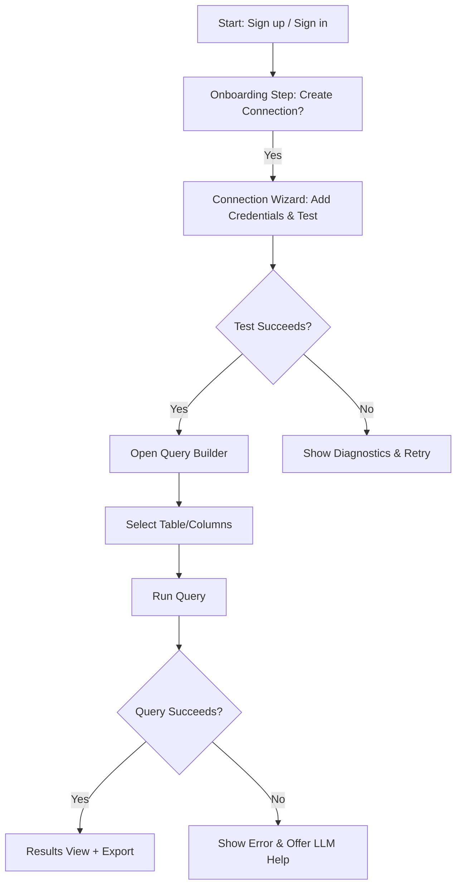

# DB Hive UI/UX Specification

## Introduction

This document defines the user experience goals, information architecture, user flows, and visual design specifications for DB Hive's user interface. It serves as the foundation for visual design and frontend development, ensuring a cohesive and user-centered experience that aligns with the PRD goals: secure SSH-backed connections, an approachable visual query builder, offline schema workflows, LLM-assisted query help, and interactive result visualizations.

Rationale & assumptions:

- Trade-offs: Prioritize clarity and security for the MVP over advanced visual customization. This favors a neutral, accessible design system (e.g., shadcn tokens) to accelerate delivery while leaving room for brand-specific theming later.
- Assumptions: Primary users are desktop web users (developers and analysts); mobile is out-of-scope for MVP. No formal brand guide or accessibility audit provided — default to WCAG AA and neutral styling.
- Decisions needing validation: Confirm primary user device mix, acceptance of shadcn tokens, exact WCAG target, and LLM opt-in/consent model for enterprise customers.

---

## Overall UX Goals & Principles — FINAL (CONFIRMED)

Purpose: Establish target personas, measurable usability goals, and 3–5 core design principles that will guide UI decisions for DB Hive.

Decisions (confirmed):

- Compliance target: WCAG AA (confirmed).
- Primary device distribution: Desktop-first (confirmed).
- LLM assistance default: Off at the org level by default; users can opt-in per session or per query; admins may enable org-level defaults as a policy setting.

Target User Personas (confirmed):

- Power User (Developer / Data Analyst)
- Casual Analyst (Non-technical Analyst)
- Administrator / Data Steward
- (Optional) Security Officer — include when enterprise customers require deeper audit/governance controls

Usability Goals & Core Design Principles (confirmed):

- Ease of learning: New users can complete core setup and run a first successful query within 10 minutes (PRD onboarding acceptance criteria).
- Efficiency for power users: Frequent tasks achievable with minimal clicks and strong keyboard affordances.
- Error prevention and recovery: Clear validation, preflight checks for offline schema uploads, and contextual guidance from LLM assistance.
- Memorability: Infrequent users can return without relearning key flows via clear information architecture and progressive disclosure.

Core Design Principles (proposed):

1. Clarity over cleverness — Prefer explicit labels and predictable behaviors.
2. Progressive disclosure — Surface complexity only when needed to reduce cognitive load.
3. Consistent patterns — Reuse components and interactions across screens for predictability.
4. Immediate feedback — Actions should show clear, timely responses (toasts, inline errors, spinners).
5. Accessible by default — Design with WCAG AA baseline, keyboard navigation, and semantic markup.

Detailed rationale, trade-offs & assumptions:

- Progressive disclosure vs discoverability: Hiding advanced controls reduces clutter for casual users but risks hiding valuable features from power users. We'll surface key power-user affordances (keyboard shortcuts, SQL toggle) while keeping advanced panels collapsible.
- LLM opt-in trade-off: Making LLM assistance opt-in controls cost and trust but may reduce discoverability of helpful features. Recommend opt-in default at session level with easy per-query toggles and clear cost/consent messaging.
- Offline workspace clarity: The UI must make the difference between live and offline states unmistakable to avoid accidental data exposure. This impacts chrome and session scoping (banners, badges, and modal confirmations).
- Accessibility baseline: WCAG AA is a pragmatic default; raising to AAA or bespoke enterprise accessibility will increase design/engineering effort and should be scoped explicitly.
- Design system choice: Use a token-based system (e.g., shadcn) to accelerate implementation; confirm whether a branded theme will be applied later.

Areas needing validation / open questions:

- Confirm the final compliance target (WCAG AA vs AAA).
- Validate primary user device distribution (desktop vs tablet vs mobile).
- Confirm enterprise needs for a Security Officer persona and depth of audit requirements.
- Decide whether LLM assistance should default to off at org-level or opt-in per user by default.

---

## Change Log

| Date | Version | Description | Author |
|------|---------|-------------|--------|
| 2025-10-08 | v0.1 | Initial UI/UX specification draft (Introduction + UX goals). | GitHub Copilot |

Rationale: Maintain a clear version history for the UI/UX specification so stakeholders can track decisions, approvals, and iterative changes. This mirrors the PRD change log and supports auditability for enterprise requirements.

Assumptions: Change log entries will be updated on major drafts or after stakeholder sign-off events.

---

## Information Architecture (IA) — FINAL (CONFIRMED)

Purpose: Define the high-level site map, navigation patterns, and screen inventory to inform flows, wireframes, and component organization.

Decisions (confirmed):

- Results access pattern: Results will be accessible primarily from the Query Builder (workflow-first) and surfaced via Dashboard quick-run / recent query widgets — Results will not be a top-level persistent nav item to reduce nav clutter and emphasize the build → run → explore workflow.
- Multi-tenant / org-scoping: Support multi-tenant org/space scoping and admin-level overlays for enterprise customers. Admin overlays will provide scoped views (org-wide saved queries, audit logs, LLM budgets) with clear permission boundaries.
- Connections vs Offline Workspace: Combine under a single top-level area called "Data Sources" with subsections for "Connections" and "Offline Workspace" so users have one canonical place to manage data inputs.

Navigation structure (updated):
- Primary Navigation: Dashboard, Query Builder, Data Sources, Settings
- Data Sources expands to: Connections, Offline Workspace
- Results: reachable from Query Builder and Dashboard; not a separate primary nav item

Rationale: These choices reduce top-level nav surface area while keeping task flows discoverable and aligned to canary goals.

---

## User Flows — FINAL (CONFIRMED)

Purpose: Define step-by-step flows for the most critical user tasks so designers and engineers can create wireframes, component contracts, and automated tests.

Decisions (confirmed):

- Onboarding flow: Do not force a successful live connection before allowing users to explore the canvas. Allow a "Skip and try offline" path that populates the canvas with simulated/demo data or lets users upload an offline schema to try the builder immediately.
- Connection diagnostics verbosity: Provide toggleable diagnostics — a concise, user-friendly diagnostics view for non-technical users and an "Advanced Diagnostics" toggle for power users and engineers. Preserve error codes and raw probe output under the advanced view for debugging.
- LLM suggestion recovery: Provide an explicit recovery path when LLM suggestions alter queries: an undo stack / query history, and a versioned query history so users can revert changes and audit applied suggestions. Also require explicit "Apply" for LLM changes to reduce accidental edits.

Flow updates & acceptance criteria: keep the existing flows and acceptance criteria but annotate them with the confirmed decisions above to guide implementation and testing.

Flow 1: Onboarding → First Query

**User Goal:** New user completes onboarding, sets up a connection, and runs their first successful query to view results.

**Entry Points:** Sign-up/onboarding entry, "Get started" CTA on Dashboard, or first-run modal after auth.

**Success Criteria:** User completes connection setup, runs a query against a simulated/live connection, and sees results in the Results View. Onboarding metrics track time-to-first-query < 10 minutes.

Mermaid flow diagram:

**Edge Cases & Error Handling:**
- Connection test fails due to network/credentials: surface diagnostics and suggested fixes; allow user to save as "offline schema" if available.
- User abandons onboarding: save partial progress and provide a quick re-entry point on Dashboard.
- LLM suggestion failures: fall back to error hints and sample queries.

**Notes:** Include simulated connectors for the canary to reduce setup friction; provide clear live vs offline state indicators throughout the flow.

Flow 2: Add & Test Connection

**User Goal:** User adds a new DB connection and verifies access and schema discovery.

**Entry Points:** Connections page > Add Connection, or Connection quick-action from Query Builder.

**Success Criteria:** Connection created, test returns schema preview, and connection appears in Schema Explorer for query building.

**Steps (high level):**
1. User clicks "Add Connection" and fills host/port/auth method.
2. User uploads SSH key or enters credentials.
3. User clicks "Test Connection"; backend runs simulator or real probe.
4. If successful, show parsed schema preview and enable "Use Connection".
5. If failure, display diagnostics and remediation steps.

**Edge Cases & Error Handling:**
- Unsupported DB version or driver: detect and suggest compatibility notes.
- Long test times: show progress and allow cancel; provide estimated wait times.
- Secrets handling: never display secrets in logs; surface security guidance on key permissions.

Flow 3: Offline Schema Upload → Local Query

**User Goal:** Upload a schema file to the Offline Workspace and run queries locally without exposing external credentials.

**Entry Points:** Offline Workspace > Upload Schema, or Dashboard "Upload schema" CTA.

**Success Criteria:** Uploaded schema is parsed, user can create queries in the Offline Canvas, and results return from local simulator or sample data.

**Steps (high level):**
1. User uploads .sql or JSON schema file.
2. Preflight parser validates and shows table/column mapping and parsing warnings.
3. User confirms and opens Offline Canvas populated with parsed schema.
4. User builds visual query and runs it against local simulator; results displayed.

**Edge Cases & Error Handling:**
- Parser failures: provide line-level errors and a suggested remediation path.
- Conflicting schema formats: allow user to map/rename ambiguous elements during preflight.
- Large schema files: provide background parsing with notification when ready, and a preview of detected top-level tables.

Detailed rationale, trade-offs & assumptions:

- Choice of flows: Prioritize canary-critical flows that validate onboarding, connection management, and offline scenarios (Epic 1 + Epic 2). These flows map directly to acceptance criteria in the PRD and will inform wireframes and test harnesses.
- Trade-offs: Keeping onboarding lightweight speeds time-to-first-query but may hide necessary security steps (key permissions, org-level policies). We'll split security-sensitive steps behind optional advanced screens in onboarding.
- Assumptions: Simulators will be available for early testing to avoid requiring real DB access. We assume users will prefer a guided wizard for connection setup for the MVP.
- Decisions needing validation: Degree of wizardization vs manual advanced options; whether to require an explicit "confirm offline mode" modal when switching from live to offline canvases; acceptable timeouts for long-running connection tests.

Areas needing validation / open questions:

- Should onboarding force a successful connection before allowing canvas exploration, or allow a simulated "skip and try offline" path to reduce initial friction?
- How verbose should connection diagnostics be for non-technical users vs power users (toggleable advanced diagnostics)?
- Do we provide a clear recovery path when LLM suggestions alter queries unintentionally (e.g., an "undo" or query history)?

---

## Wireframes & Mockups — DRAFT (REQUIRES FEEDBACK)

Purpose: Clarify where visual designs will be created, provide low-fidelity wireframe guidance for key screens, and define conventions for handoff to visual designers and front-end engineers.

Primary design files (proposed):

- Primary design tool: Figma (recommended) — create a shared team file `DB Hive / MVP` with pages for wireframes, components, and high-fidelity frames.
- Alternate: Miro for collaborative IA and flows; export frames to Figma for implementation.

Low-fidelity layout guidance (desktop-first):

- Grid: 12-column responsive grid, 16px base spacing with a 4px spacing scale.
- Navigation: Left collapsible side nav for desktop; top nav fallback for narrow viewports.
- Canvas: Central query canvas with right-side assistant pane and left-side schema explorer; results modal or bottom sheet for result exploration.
- Density: Default comfortable spacing for readability; compact mode toggle for power users.

Key Screen Layouts (repeatable entries):

- Authentication / Onboarding
  - Purpose: Fast account creation and guided first-run flow to connect a data source and run a sample query.
  - Key Elements:
    - Signup/Login form, social/OAuth options
    - Onboarding checklist (Create connection, Run sample query)
    - Contextual help and tutorial progress indicator
  - Interaction Notes: Inline validation on credentials, progress save, CTA to skip with simulated demo data reference
  - Design File Reference: `Figma: Onboarding / v0.1` (placeholder)

- Dashboard
  - Purpose: Entry point showing recent queries, saved queries, and telemetry cards
  - Key Elements:
    - Recent queries list with quick-run action
    - Saved queries with folders/tags
    - Telemetry widgets (First Query Success, LLM Apply Rate)
  - Interaction Notes: Quick actions for re-run and clone; expandable cards for telemetry
  - Design File Reference: `Figma: Dashboard / v0.1` (placeholder)

- Query Builder (Primary)
  - Purpose: Visual query composition and two-way SQL sync
  - Key Elements:
    - Schema Explorer (left)
    - Visual Canvas (center) with draggable table blocks
    - SQL Preview / Raw Editor (collapsible bottom or right)
    - LLM Assistant (right-side pane, opt-in per session)
    - Run/Export controls (top-right sticky)
  - Interaction Notes: Drag-to-add, connect blocks for joins, inline column pickers, keyboard shortcuts (Cmd/Ctrl+K for quick search), real-time SQL preview
  - Design File Reference: `Figma: Query Builder / v0.1` (placeholder)

- Connection Manager
  - Purpose: Manage DB connections and run diagnostics
  - Key Elements:
    - Connection list with status badges
    - Add/Edit modal with credential upload
    - Test Connection flow with schema preview and diagnostics panel
  - Interaction Notes: Secure upload UX for keys, rotate credential flow, last-test timestamp
  - Design File Reference: `Figma: Connections / v0.1` (placeholder)

- Offline Workspace / Schema Upload
  - Purpose: Upload and validate schema files for local query building
  - Key Elements:
    - Upload area with drag/drop and supported formats
    - Preflight parser output with mapping editor
    - Offline Canvas with parsed schema in explorer
  - Interaction Notes: Parse progress UI, mapping modal for ambiguous tables, confirmation before enabling offline queries
  - Design File Reference: `Figma: Offline Workspace / v0.1` (placeholder)

- Results View
  - Purpose: Display query results, inline charting, and export/share actions
  - Key Elements:
    - Tabbed view (Table, Charts)
    - Export / Share button with options
    - Row-level actions and pagination controls
  - Interaction Notes: Quick chart creation from selected columns, preview for large exports
  - Design File Reference: `Figma: Results / v0.1` (placeholder)

Design fidelity & handoff conventions:

- Start with low-fidelity wireframes for each key screen; iterate to mid/high fidelity only after IA and critical flows are validated.
- Establish a component library in Figma with tokens mapped to the code design system (color, typography, spacing) and deliver a token export (CSS/JSON) for frontend implementation.
- Accessibility annotations: Each frame should include keyboard/tab order notes, focus states, and color-contrast callouts for critical controls.

Detailed rationale, trade-offs & assumptions:

- Fidelity trade-off: Low-fidelity wireframes speed alignment and reduce rework; however, high-fidelity mocks are required for final handoff to frontend to reduce ambiguity. We'll adopt an iterative approach where only canary screens are high-fidelity initially.
- Tooling choice: Figma is industry-standard for component handoff and works well with dev tooling; choose Figma unless the team has an established alternative.
- Accessibility: Annotating accessibility in the design files reduces implementation drift and clarifies acceptance criteria for QA.

Areas needing validation / open questions:

- Confirm design tool (Figma vs Sketch vs other) and whether the team needs a shared design token pipeline for automation.
- Decide which screens require high-fidelity prototypes for user testing versus which can remain wireframe-level for MVP.
- Confirm visual theme direction (neutral shadcn tokens vs brand-first theme) and whether a branding pass is required pre-handoff.

---

<!-- ELICITATION NOTE: The section 'Wireframes & Mockups' is marked elicit: true in the template. Feedback is required before proceeding. -->

---

## Component Library / Design System — FINAL (CONFIRMED)

- Chosen stack: `shadcn/ui` + Tailwind CSS (confirmed).
- MCP integration: Owner will provide MCP package location; frontend team to integrate MCP into workspace and vet components.
- Storybook as source-of-truth: Use Storybook + Chromatic + axe for design/visual QA since there is no Figma yet. Create a minimal Figma token file only if/when stakeholders request high-fidelity prototypes.

Action items (added):
- Please provide the MCP package path or registry location so the frontend team can start integration.

---

## Branding & Style Guide — FINAL (CONFIRMED)

Decisions (confirmed):

- Immediate branded theme: Not required for MVP — neutral token set accepted.
- Primary/Secondary colors: Proposed palette approved for MVP and will be used as the default semantic tokens.
- Typeface: Use Inter (default) for the MVP; revisit premium licensing only if a branding pass is requested later.

Remove previous open-question notes and mark the Branding section as confirmed for MVP use.

---

## Accessibility Requirements — DRAFT (REQUIRES FEEDBACK)

Purpose: Define a practical, testable accessibility baseline for the MVP and a roadmap for improvements so the product meets legal/ethical expectations while remaining deliverable for the canary.

Compliance Target (proposed):

- Target: WCAG 2.1 AA baseline for all critical user flows (onboarding, connection setup, query building, results exploration).
- Roadmap: Track improvements toward WCAG 2.2 and selective AAA goals post-MVP if customers require higher compliance or formal audits.

Key Requirements (proposed):

- Visual:
  - Color contrast: Maintain a minimum contrast ratio of 4.5:1 for normal text and 3:1 for large text; use semantic color tokens to enforce this across themes.
  - Focus indicators: Visible focus outlines for all interactive elements; high-contrast focus styles for keyboard users.
  - Scalable text: Support browser text scaling up to 200% without layout breakage.
  - Reduced motion: Respect prefers-reduced-motion and provide a global toggle in settings for users who need reduced motion.

- Interaction:
  - Keyboard navigation: Full keyboard support for all interactive flows (Tab order, shortcut keys for power-user flows, Enter/Esc behaviors).
  - Skip links & landmarks: Provide skip-to-main and ARIA landmarks for screen-reader navigation.
  - Touch targets: Minimum 44x44px touch targets for mobile/tablet interactions; provide compact mode for dense desktop usage.
  - Error reporting: Accessible error messages with clear instructions and ARIA alerts for dynamically updated content.

- Content & Semantics:
  - Semantic HTML: Use proper heading hierarchy (H1..H6), lists, and semantic roles for interactive widgets.
  - Form labels and instructions: Explicit labels, placeholder not as sole label, and aria-describedby for contextual help.
  - Alt text: Mandatory alt text for meaningful images; decorative images marked with empty alt.
  - Table semantics: Use accessible table markup with captions and column headers for result tables; provide CSV export as an alternative view.

Testing Strategy (proposed):

- Automated:
  - Integrate axe-core or equivalent into unit/component tests and CI to catch regressions.
  - Run Lighthouse accessibility audits in PR checks for a high-level view.
  - Visual regression tests for focus states and density modes.

- Manual:
  - Keyboard-only walkthroughs for critical paths (onboarding, create connection, run query, export results).
  - Screen reader testing (VoiceOver, NVDA) for key flows, especially the Query Builder and Results View.
  - Targeted manual tests for dynamic content (LLM Assistant, streaming results) to verify announcements and live regions.

- User testing & validation:
  - Recruit 1–3 users with assistive-technology needs for early usability testing on canary builds.
  - Maintain an accessibility issue backlog with severity/prio tags for remediation planning.

Detailed rationale, trade-offs & assumptions:

- MVP scope: Aim for WCAG AA on core flows to balance legal/commercial risk and delivery speed. Full AAA compliance is resource-heavy and often unnecessary unless contractually required.
- Performance vs accessibility: Some accessibility features (e.g., verbose ARIA descriptions) can add DOM weight; prefer lazy-load strategies for heavy panels and prioritize semantic markup.
- LLM outputs: Treat generated content as untrusted for accessibility (ensure proper semantic wrappers and ARIA announcements when assistant content appears).

Areas needing validation / open questions:

- Confirm formal compliance obligations (e.g., procurement with Section 508 or enterprise accessibility clauses) and any jurisdiction-specific rules.
- Decide whether to require automated a11y checks on every PR or only for PRs touching UI components.
- Confirm resources and cadence for manual accessibility testing and whether assistive-technology participants will be available for early user tests.

---

<!-- ELICITATION NOTE: The section 'Accessibility Requirements' is marked elicit: true in the template. Feedback is required before proceeding. -->

---

## Responsiveness Strategy — DRAFT (REQUIRES FEEDBACK)

Purpose: Define breakpoints and adaptation strategies to ensure the product works well across desktop, tablet, and limited mobile contexts while prioritizing the desktop-first workflows for MVP.

Breakpoints (proposed):

| Breakpoint | Min Width | Max Width | Target Devices |
|------------|-----------:|----------:|----------------|
| Mobile     | 0px        | 599px     | Small phones, narrow screens |
| Tablet     | 600px      | 1023px    | Tablets, small laptops |
| Desktop    | 1024px     | 1439px    | Laptops, desktop monitors |
| Wide       | 1440px     | —         | Large monitors, dashboards |

Adaptation Patterns (proposed):

- Layout Changes: Switch from a single-column stacked layout on Mobile to a two/three-column canvas on Desktop. Use a responsive grid and flexible container widths; collapse side panels on narrow viewports.

- Navigation Changes: Collapse primary nav into a hamburger or bottom-sheet on Mobile; keep left persistent side-nav on Desktop with a collapsible mode for tablet.

- Content Priority: Prioritize the Query Builder and Schema Explorer for Desktop; on Mobile show a compact Explorer + quick-run preview and defer heavy charting to larger screens or export options.

- Interaction Changes: Replace drag-and-drop with tap-to-add on touch devices; increase hit-target sizes and provide explicit edit dialogs for operations that are difficult on touch.

Detailed rationale, trade-offs & assumptions:

- Desktop-first choice: PRD user persona distribution favors desktop power users (analysts/developers). Desktop-first allows richer canvas interactions (drag-to-connect, complex join UIs) for the canary. Mobile will be supported in a limited, high-value way later.

- Performance trade-offs: Avoid shipping heavy charting libraries by default to mobile viewports; lazy-load visualization code and use server-side pagination for result previews to reduce initial payload.

- Consistency vs platform conventions: Preserve core flows across form factors while adapting interactions to platform norms (e.g., gestures/tap vs drag/keyboard). This increases implementation complexity but improves usability.

- Tokenized breakpoints: Implement breakpoints as tokens in the design system to ensure parity between Figma and code and to simplify responsive behavior in components.

Areas needing validation / open questions:

- Confirm prioritized device mix and whether mobile deserves an early lightweight experience or can be deferred to post-MVP.
- Decide on strict breakpoint values or use content-driven breakpoints (i.e., break when a component layout breaks rather than fixed pixel widths).
- Confirm whether certain heavy features (inline charting, large exports) should be blocked on mobile or accessible via alternative flows (export/email/share).

---

<!-- ELICITATION NOTE: The section 'Responsiveness Strategy' is marked elicit: true in the template. Feedback is required before proceeding. -->

---

## Animation & Micro-interactions — DRAFT (REQUIRES FEEDBACK)

Purpose: Define motion design principles and key micro-interactions that add clarity and delight without compromising performance or accessibility.

Motion Principles (proposed):

- Purposeful motion: Use animation to clarify state changes and system feedback (not merely decoration).
- Fast & subtle: Prefer short, subtle animations (80–240ms) for common UI feedback and slightly longer for transitions that communicate context (300–450ms).
- Easing & rhythm: Use consistent easing (standard: cubic-bezier(.2,.9,.2,1) or ease-out) and keep motion library limited to 3–4 easing curves.
- Performance-first: Avoid large-layout animations; prefer transforms and opacity for GPU-accelerated animations.
- Respect reduced motion: Honor prefers-reduced-motion and offer a global setting to disable non-essential animations.

Key Animations (repeatable):

- Navigation open/close
  - Purpose: Communicate spatial context when side nav expands/collapses
  - Duration / Easing: 200ms / ease-out
  - Accessibility: Respect reduced-motion; provide instant collapse for reduced-motion users

- Block drag & connect (Visual Canvas)
  - Purpose: Provide visual feedback while dragging blocks and creating joins
  - Duration / Easing: real-time transform; snap animations 120–180ms
  - Accessibility: Provide non-visual affordances (aria-live text) for users using assistive tech

- Toasts & Inline Feedback
  - Purpose: Confirm actions (save, apply LLM suggestion) or show transient errors
  - Duration / Easing: enter 160ms, exit 120ms, ease-out
  - Accessibility: Ensure toasts are announced via ARIA live regions and can be dismissed via keyboard

- Result Chart Entry / Update
  - Purpose: Animate data transitions for clarity when switching groupings or filters
  - Duration / Easing: 300–450ms, ease-in-out
  - Performance: Prefer debounced animations for streaming data and provide an option to disable animation for large datasets

- Focus & Hover Micro-interactions
  - Purpose: Provide clear focus indication and hover affordances for interactive elements
  - Duration / Easing: 80–140ms, subtle scale or shadow changes
  - Accessibility: Focus must be high-contrast and persistent for keyboard users

Performance & Accessibility Constraints:

- Use transforms (translate, scale) and opacity for animations to leverage GPU acceleration; avoid animating layout where possible.
- Limit simultaneous animations; batch or stagger animations to reduce main-thread work.
- Provide a global setting to reduce or disable non-essential motion; respect the OS-level prefers-reduced-motion setting.
- For heavy visualizations, provide an option to animate trimmed previews or static snapshots to avoid janky frames on lower-end devices.

Testing & Validation:

- Unit tests: Snapshot tests for states that trigger animations (open/closed states) and visual regression tests for key frames.
- Performance tests: Measure frame rates for the Query Builder canvas during typical drag/join scenarios in CI (or nightly profiling); set guardrails (e.g., 60fps target on modern desktops, 30fps fallback on low-end devices).
- Accessibility tests: Verify reduced-motion mode disables non-essential animations; ensure ARIA announcements for dynamic changes and toast messages.

Rationale, trade-offs & assumptions:

- Motion improves comprehension but can harm performance and accessibility; default to subtle, purposeful motion and provide opt-out.
- Precision vs delight: More elaborate animations can delight power users but risk performance regressions during early canary builds; keep animations conservative for MVP.
- Data-driven animations: Animating chart transitions is valuable for comprehension but must be throttled for large/streaming datasets to avoid CPU/GPU overload.

Areas needing validation / open questions:

- Confirm acceptable defaults for animation durations and whether the team wants a separate 'reduced' motion profile by default for mobile users.
- Decide whether to include a small animation token library in Figma for designers to reuse exact curves and durations.
- For streaming results, should animation be disabled by default or enabled with a dataset-size threshold?

---

<!-- ELICITATION NOTE: The section 'Animation & Micro-interactions' is marked elicit: true in the template. Feedback is required before proceeding. -->

---

## Performance Considerations — DRAFT

Purpose: Define measurable frontend performance goals and engineering strategies that preserve UX quality while supporting the PRD's query-performance expectations.

Performance Goals (proposed):

- Page Load (app shell): First meaningful paint <= 1.5s on desktop-class networks; Time-to-interactive (TTI) <= 2.5s for core pages.
- Interaction Response: UI interactions (toolbar clicks, canvas moves, selection) should respond within 100ms perceived latency on modern desktops.
- Animation & Canvas FPS: Maintain 60fps for interactive canvas actions on modern desktops; gracefully degrade to 30fps on low-end devices.
- Query Execution UX: Surface backend query latency targets from the PRD (95th percentile <= 5s for representative datasets); UI must handle longer-running queries with streaming/partial results and clear progress state.

Design Strategies:

- Loading and code-splitting: Use Next.js SSR/ISR where helpful for initial pages, dynamic imports for heavy components (chart libs, editors), and route-level code-splitting to shrink initial payloads.
- Lazy-load visualizations and heavy libraries (charting, editor extensions) only when needed; provide lightweight placeholders/skeletons.
- Virtualization & pagination: Use windowing (virtualized lists/tables) for result sets and client-side pagination + server-side pagination/streaming for large datasets.
- Off-main-thread work: Use Web Workers for schema parsing, offline preflight parsing, and heavy transformations to avoid jank on the main thread.
- Caching & optimistic UI: Cache schema and recent query results; show optimistic previews where safe and fallback to actual results when available.
- Throttling & debouncing: Throttle frequent updates (typing, drag events) and debounce expensive backend calls (autocomplete, LLM suggestions) to reduce load and cost.
- Progressive rendering: Render skeletons and progressively enhance pages as data arrives to improve perceived performance.

Monitoring & Acceptance Criteria:

- Instrument RUM (front-end metrics), synthetic tests (PageSpeed/Lighthouse), and CI performance budgets. Track FCP, LCP, TTI, CLS, and custom interaction metrics (canvas-drag-latency, query-run-latency).
- Define performance budgets (e.g., first load JS < 200KB for the app shell excluding optional libs) and fail CI on budget regressions.
- Establish alerting for key metric regressions and nightly profiling for the Query Builder canvas under simulated interactions.

Trade-offs & Assumptions:

- Trade-offs: Prioritize perceived performance (skeletons, progressive rendering) over shipping all features eagerly. Some advanced features (full charting, heavy editor plugins) will be lazy-loaded or gated behind canary toggles.
- Assumptions: Target users mostly on desktop; mobile budgets can be stricter and some features deferred.

Areas needing validation / open questions:

- Agree on hard performance budgets for initial payloads and which heavy libraries (charting, editor) are acceptable to lazy-load.
- Confirm acceptable degradation strategy for low-end devices and whether to disable specific features by default on mobile.

---

## Next Steps

Purpose: Actionable checklist to move the UI/UX spec into design, implementation, and stakeholder review.

### Immediate Actions

1. Share this draft spec with PM, Tech Lead, and Design for review and sign-off on core assumptions (WCAG target, design tool, primary device mix).
2. Prioritize canary screens (Onboarding, Query Builder, Connection Manager, Results) for high-fidelity mocks and assign owners.
3. Define performance budgets and add to CI as budget checks (initial payload targets + canvas interaction budgets).
4. Create the initial Figma file and token exports; establish a design → token → code pipeline for themes.
5. Instrument a minimal RUM/synthetic test harness for canary flows (onboarding → first query) and add telemetry events defined in PRD.

### Design Handoff Checklist

- [ ] All critical user flows documented and linked to wireframes
- [ ] Component inventory created (core components implemented or stubbed)
- [ ] Accessibility requirements annotated per screen (focus, labels, contrast)
- [ ] Responsive breakpoints and adaptation notes included for each screen
- [ ] Performance budgets and lazy-load guidance documented
- [ ] Branding tokens (color, typography, spacing) exported and mapped to code tokens

Rationale: These actions reduce ambiguity for engineers, ensure measurable performance targets, and prepare the canary for stakeholder review.

---

## Checklist Results

Purpose: Placeholder to record results when an explicit UI/UX checklist or audit is run against this document or an implementation build.

Notes:

- If an internal UI checklist exists, run it against the canary screens and paste results here (pass/fail, issues, remediation notes).
- Record accessibility check outcomes (axe/lighthouse), performance budget pass/fail, and outstanding design handoff gaps.

---

<!-- FINAL NOTE: All major template sections have been drafted. Sections marked "REQUIRES FEEDBACK" earlier remain DRAFT and will need stakeholder responses. -->
